# Predictor académico
### Código fuente del predictor de éxito académico en estudiantes universitarios

Producto de analítica de datos para universidades que quieran estudiar los factores por los cuales los estudiantes no culminan sus estudios en el tiempo predestinado. Esto, con el fin de tomar decisiones informadas respecto al acompañamiento brindado a los estudiantes y las políticas educativas que se implementan.  

### Pregunta de negocio

¿Cuáles variables pueden considerarse factores de riesgo para que un estudiante no tenga éxito académico en la universidad y cómo predecir la necesidad de acompañamiento de un estudiante a partir ellos?

#### Autores
[Daniela Ruiz](https://github.com/danielaruizl1) (Formulación del modelo, creación del dashboard y creación del servidor)

[Juan D. Umaña](https://github.com/juan-umana) (Exploración de datos, formulación y evaluación del modelo, reporte)

### Metodología

El predictor académico ha sido desarrollado con datos recolectados por el estudio [Early prediction of student's performance in higher education: a case study](https://archive.ics.uci.edu/dataset/697/predict+students+dropout+and+academic+success)

En su primera versión el predictor utilizó las variables continuas y categoricas con mayor correlación sobre la variable objetivo: haberse graduado como estado de éxito académico.

Posteriormente estos predictores son utilizados en una red bayesiana para parametrizar un modelo predictivo en el cual se recolecte la información de futuros estudiantes y se ofrezca información temprana sobre el posible desempeño que tendrá en su carrera.

Por último, el producto se ofrece como un tablero interactivo alojado en un servidor AWS para que usuarios puedan acceder al modelo de forma remota y evaluar las predicciones para sus estudiantes.

### Resultados - Exploración de datos

#### Selección de variables

El estudio contempla 36 variables con potencial predictor y una variable target categórica que denota si el estudiante se gradúo (éxito) o si se retiro o aún se encuentra matriculado (fracaso). Las variables se pueden agrupar de la siguiente forma:

Variables contínuas:

- application_order_dic = Application order (between 0 - first choice; and 9 last choice)
- prev_qual_grade_dic = Grade of previous qualification (between 0 and 200)
- admission_grade = Admission grade (between 0 and 200)
- age = Age of studend at enrollment
- units_i_semester_credited/enrolled/evaluations/approved/wo_evaluation = number of units redited/enrolled/evaluations/approved/wo_evaluation in semester i
- units_i_semester_grade = Grade average in the ith semester (between 0 and 20)
- unemployment_rate
- inflation_rate
- GDP

Variables categóricas:

- 'marital_status'
- 'application_mode'
- 'application_order'
- 'course'
- 'daytime/evening_attendance'
- 'previous_qualification'
- 'nacionality'
- 'mothers_qualification'
- 'fathers_qualification'
- 'mothers_occupation'
- 'fathers_occupation'
- 'displaced'
- 'educational_special_needs'
- 'debtor'
- 'tuition_fees_up_to_date'
- 'gender'
- 'scholarship_holder'
- 'age_at_enrollment'
- 'international'

De acuerdo con las correlaciones en las variables contínuas se decidió tomar las siguientes variables para las siguientes etapas del modelo:

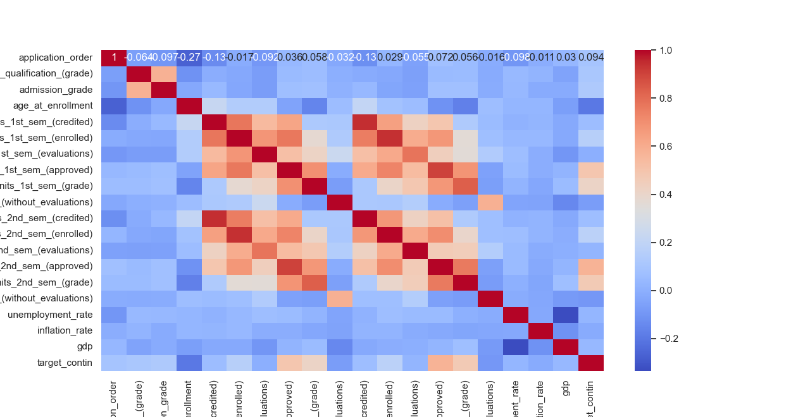
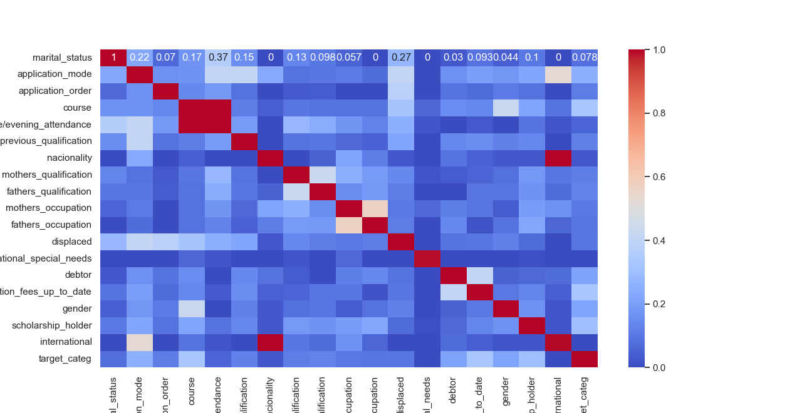

- units_i_semester_approved (positive correlation)
- units_i_semester_grade (positive correlation)
- course (positive correlation)
- tuition_fees_up_to_date (positive correlation)
- scholarship_holder (positive correlation)
- application_mode (positive correlation)
- age_at_enrollment (negative correlation)
- units_i_semester_wo_evaluation (negative correlation)
- inflation_rate (negative correlation)

A continuación gráficos y análisis descriptivos de los predictores seleccionados:

#### Unidades curriculares aprovadas en el primer y segundo semestre

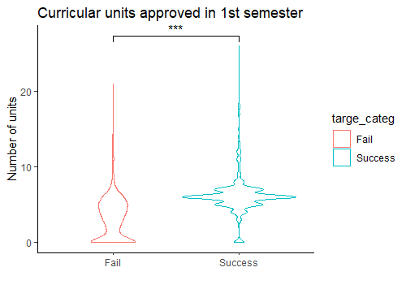
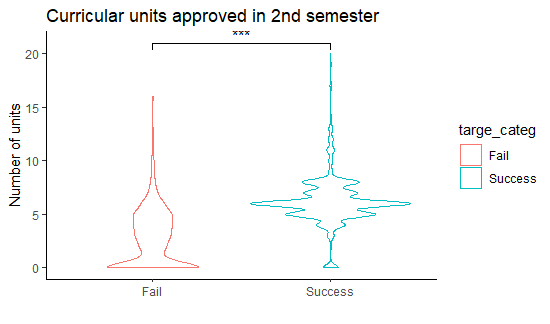

En ambos semestres las distribuciones son similares a través de ambos grupos, y
se observa que existe una diferencia significativa entre el (mayor) número de
unidades aprovadas por aquellos estudiantes que lograron éxito académico.

#### Calificaciones de las unidades aprovadas en el primer y segundo semestre

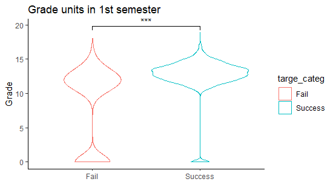
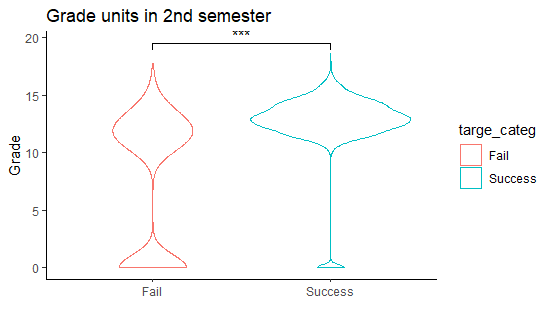

En ambos semestres las distribuciones son similares a través de ambos grupos, y
se observa que existe una diferencia significativa entre las calificaciones de
estudiantes que lograron éxito académico.

#### Cursos

Los cursos más frecuentes (y su porcentaje respecto a toda la población) de los estudiantes con éxito académico fueron:

- Nursing (12.4%)
- Social Service (5.6%)
- Journalism and Communication (4.4%)

Los cursos más frecuentes (y su porcentaje respecto a toda la población) de los estudiantes sin éxito académico fueron:

- Management (5.5%)
- Nursing (4.9%)
- Management (evening attendance) (4.3%)

#### Matrícula

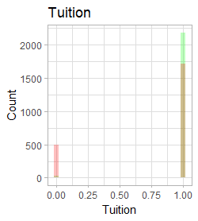

Al agrupar los datos por rendimiento académico se observa que la mayoría de estudiantes que no se encuentran al día con su matrícula fueron estudiantes que no se graduaron

#### Beca

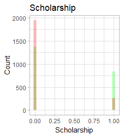

Al agrupar los datos por rendimiento académico se observa que la mayoría de estudiantes que poseen una beca lograron éxito académico 

#### Tipo de aplicación

Los tipos de aplicación más frecuentes (y su porcentaje respecto a toda la población) de los estudiantes con éxito académico fueron:

- 1st phase : general contingent (24.0%)
- 2nd phase : general contingent (10.3%)
- Over 23 years old (5.2%)

Los tipos de aplicación más frecuentes (y su porcentaje respecto a toda la población) de los estudiantes sin éxito académico fueron:

- 1st phase : general contingent (14.6%)
- Over 23 years old (12.6%)
- 2nd phase : general contingent (9.4%)

#### Edad al momento de inscripción

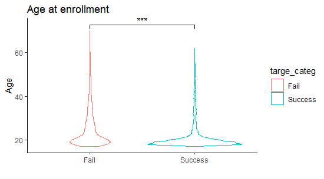

Existe una diferencia significativa entre las edades de los estudiantes con distinto desenlace académico, siendo el grupo de estudiantes que logró éxito académico aquel con menor edad

#### Unidades sin evaluación en el primer y segundo semestre

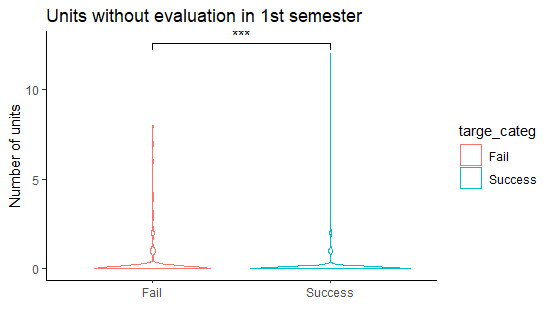
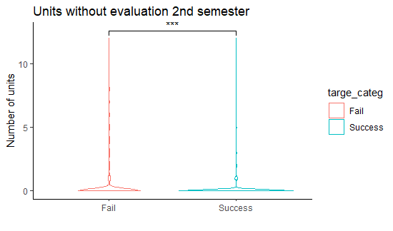

En ambos semestres las distribuciones son similares a través de ambos grupos, y
se observa que existe una diferencia significativa entre el número de
unidades aprovadas por aquellos estudiantes que lograron éxito académico.

#### Tasa de inflación

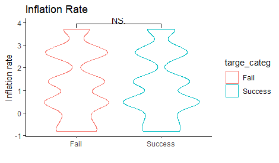

La tasa de inflación en ambos grupos presentan distribuciones sin diferencias significativas

### Resultados - Formulación del modelo

Dada la potencial interacción entre las variables y su correlación con el desempeño del estudiante, decidimos que todas afectarían directamente la variable objetivo a excepción de las calificaciones obtenidas el primer y el segundo semestre, como se observa en la Figura. Esto debido a que esperamos que un buen desempeño en el primer periodo pueda ser un potencial predictor del segundo periodo, y ambos serán potenciales predictores del desempeño final. Además, la disposición de esta red permite que en los casos en los que se conozcan las calificaciones del segundo semestre del estudiante estás sean las únicas relevantes, ignorando así su desempeño el semestre anterior; pero en aquellos casos en donde no se conozcan las calificaciones del segundo semestre (o el estudiante aún no lo haya cursado), su desempeño en el primer periodo será suficiente para que la red realice una predicción.

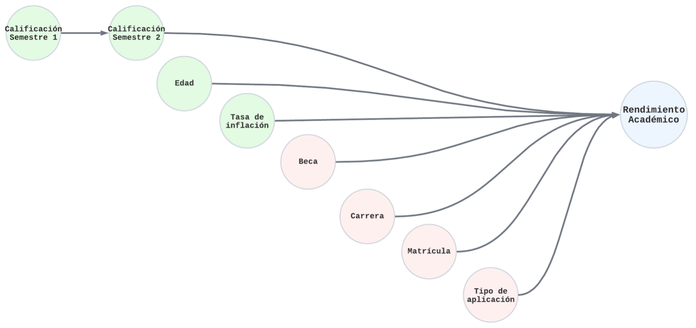

El desempeño del modelo completo genera una excatitud (accuracy) de 59.2%. Teniendo en cuenta que tiene una clasificación tripe (Desertar, Continuar matrículado, y Gradiarse), este desempeño proporciona una mejor predicción que una asignación aleatoria en donde cada categoría tiene 33.3% porciento de probabilidad de ocurrencia. La tabla a continuación presenta la matriz de confusión para el modelo.

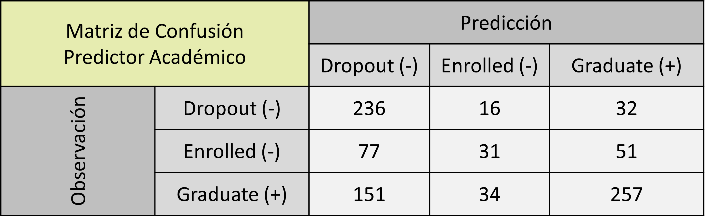

### Resultados - Tablero (dashboard)

El prototipo de Tablero (dashboard) presenta el producto desarrollado, su objetivo y alcance. Su forma de uso consiste en digitar los valores de las variables incluidas en el modelo y las personas usuarias tendrán como resultado el desenlace académico más probable para el estudiante

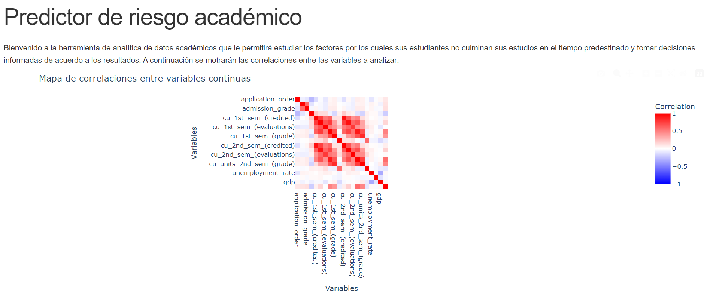

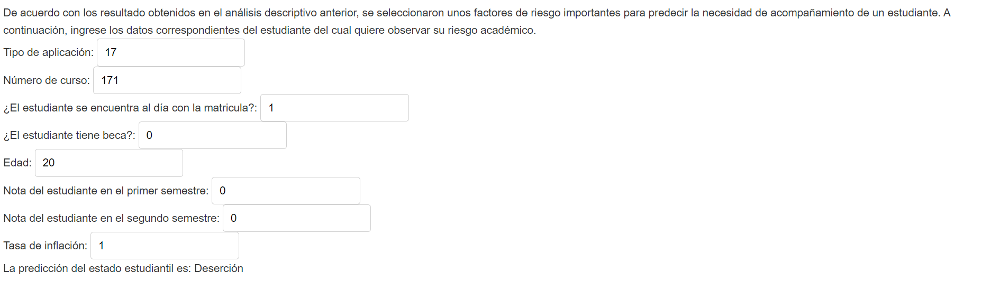
